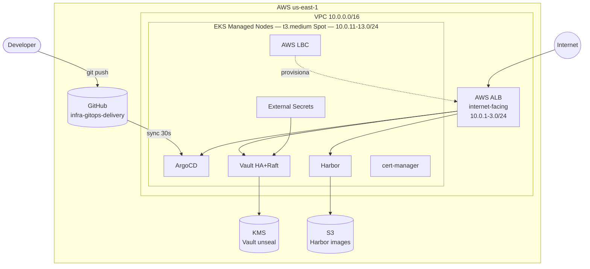
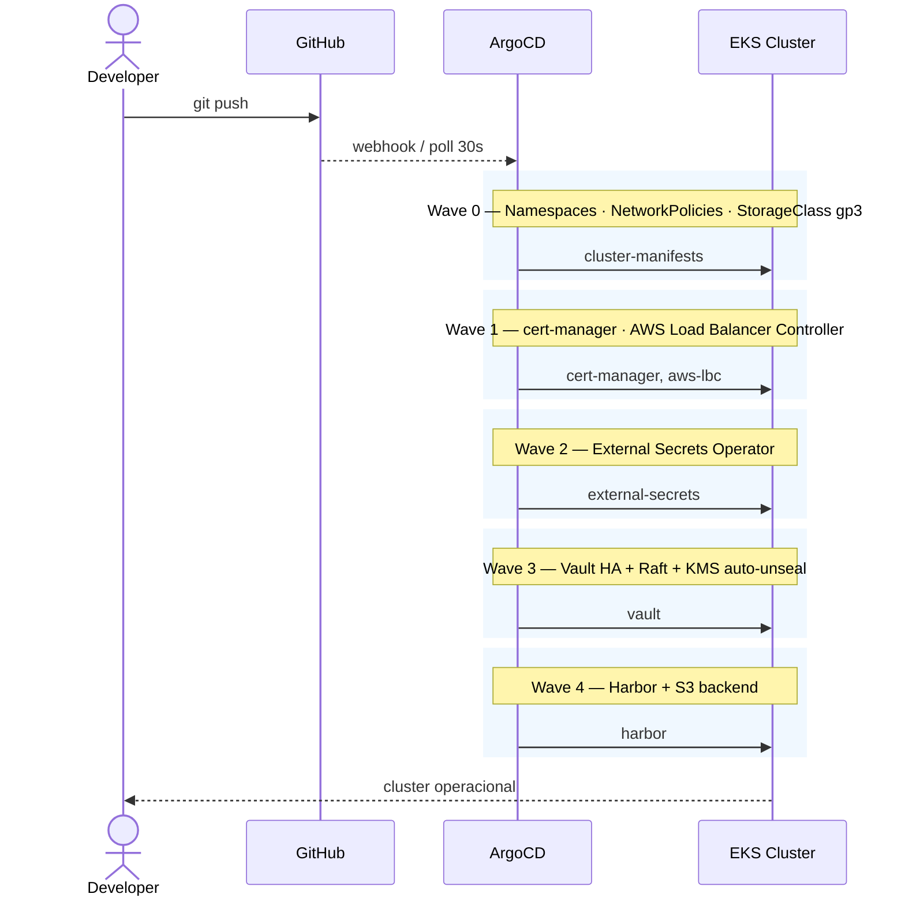

<div align="center">

<br/>
```
 ██████╗ ██╗     ██╗   ██╗███████╗██████╗ ██████╗ ██╗███╗   ██╗████████╗
 ██╔══██╗██║     ██║   ██║██╔════╝██╔══██╗██╔══██╗██║████╗  ██║╚══██╔══╝
 ██████╔╝██║     ██║   ██║█████╗  ██████╔╝██████╔╝██║██╔██╗ ██║   ██║
 ██╔══██╗██║     ██║   ██║██╔══╝  ██╔═══╝ ██╔══██╗██║██║╚██╗██║   ██║
 ██████╔╝███████╗╚██████╔╝███████╗██║     ██║  ██║██║██║ ╚████║   ██║
 ╚═════╝ ╚══════╝ ╚═════╝ ╚══════╝╚═╝     ╚═╝  ╚═╝╚═╝╚═╝  ╚═══╝   ╚═╝
```

### EKS GitOps Blueprint

**Guia completo para construir um cluster EKS production-grade com GitOps**

<br/>

[](https://RhuanCSG.github.io/eks-gitops-blueprint/)
[](LICENSE)
[](https://aws.amazon.com/eks/)
[](https://argo-cd.readthedocs.io/)
[](https://developer.hashicorp.com/vault)
[](https://goharbor.io/)

<br/>

**[→ Abrir Documentação Completa](https://RhuanCSG.github.io/eks-gitops-blueprint/)**

<br/>

</div>

---

## Sobre o Projeto

Este repositório documenta, passo a passo, a construção de um laboratório de infraestrutura GitOps utilizando AWS EKS. Cada decisão arquitetural é justificada, cada comando é explicado, e boas práticas de produção são aplicadas desde a primeira linha — mesmo sendo um laboratório de estudos.

Ao final do guia, você terá um cluster completo operacional e um modelo reutilizável para ambientes reais.

---

## O que você vai construir



**Fluxo GitOps com sync waves:**



---

## Guia em 10 Etapas

| # | Etapa | O que você faz |
|:---:|---|---|
| **01** | [Pré-requisitos](https://RhuanCSG.github.io/eks-gitops-blueprint/01-prerequisites/) | Instalar ferramentas, configurar AWS CLI e credenciais |
| **02** | [VPC e Networking](https://RhuanCSG.github.io/eks-gitops-blueprint/02-vpc-networking/) | Criar VPC, subnets públicas/privadas, NAT, KMS, S3 |
| **03** | [Cluster EKS](https://RhuanCSG.github.io/eks-gitops-blueprint/03-eks-cluster/) | Provisionar EKS com Spot Instances, addons e StorageClass gp3 |
| **04** | [ArgoCD](https://RhuanCSG.github.io/eks-gitops-blueprint/04-argocd/) | Instalar ArgoCD e configurar o padrão App of Apps |
| **05** | [HashiCorp Vault](https://RhuanCSG.github.io/eks-gitops-blueprint/05-vault/) | Vault HA com Raft, KMS auto-unseal e Kubernetes auth |
| **06** | [Harbor Registry](https://RhuanCSG.github.io/eks-gitops-blueprint/06-harbor/) | Registry privado com backend S3 e robot accounts |
| **07** | [External Secrets](https://RhuanCSG.github.io/eks-gitops-blueprint/07-external-secrets/) | Sincronizar segredos do Vault para Kubernetes Secrets |
| **08** | [cert-manager](https://RhuanCSG.github.io/eks-gitops-blueprint/08-cert-manager/) | Certificados TLS automáticos com Let's Encrypt |
| **09** | [AWS Load Balancer](https://RhuanCSG.github.io/eks-gitops-blueprint/09-aws-load-balancer/) | ALBs automáticos e exposição das ferramentas via HTTP |
| **10** | [Destruição dos Recursos](https://RhuanCSG.github.io/eks-gitops-blueprint/10-cleanup/) | Remover todos os recursos AWS para evitar cobranças |

> [!TIP]
> Todos os comandos têm versões para **Linux/macOS** e **Windows (PowerShell)** — sem necessidade de WSL.

---

## Stack

<table>
<thead>
<tr><th>Camada</th><th>Tecnologia</th><th>Decisão</th></tr>
</thead>
<tbody>
<tr><td>Cloud</td><td>AWS us-east-1</td><td>Menor custo, maior disponibilidade de Spot</td></tr>
<tr><td>Kubernetes</td><td>Amazon EKS 1.32+</td><td>Control plane gerenciado</td></tr>
<tr><td>Nodes</td><td>t3.medium · Spot · 3 AZs</td><td>Custo mínimo com alta disponibilidade</td></tr>
<tr><td>SO</td><td>Amazon Linux 2023</td><td>Suporte ativo, sem versões deprecadas</td></tr>
<tr><td>Storage</td><td>EBS gp3 (criptografado)</td><td>Padrão atual — sem gp2</td></tr>
<tr><td>IAM</td><td>EKS Pod Identity</td><td>Padrão mais recente — sem IRSA</td></tr>
<tr><td>Network Policy</td><td>VPC CNI nativo</td><td>Sem CNI adicional (Calico)</td></tr>
<tr><td>GitOps</td><td>ArgoCD · App of Apps</td><td>Sync waves, UI, reconciliação contínua</td></tr>
<tr><td>Secrets</td><td>Vault HA + Raft + KMS</td><td>HA sem backend externo, unseal automático</td></tr>
<tr><td>Secrets sync</td><td>External Secrets Operator</td><td>Desacoplado, auditável</td></tr>
<tr><td>Registry</td><td>Harbor + S3</td><td>Persistência independente dos pods</td></tr>
<tr><td>Ingress</td><td>AWS LBC + ALB</td><td>Nativo AWS, integra com ACM e WAF</td></tr>
<tr><td>TLS</td><td>cert-manager + Let's Encrypt</td><td>Gratuito, automatizado</td></tr>
<tr><td>Docs</td><td>MkDocs Material + GitHub Pages</td><td>Documentação navegável, sem custo</td></tr>
</tbody>
</table>

---

## Boas Práticas Aplicadas

Este laboratório não abre mão de padrões de produção — mesmo sendo um ambiente de estudos:

- ✅ **EKS Pod Identity** — substituição definitiva do IRSA
- ✅ **Vault auto-unseal via KMS** — essencial com Spot Instances (pods reiniciam sem aviso)
- ✅ **NetworkPolicy default-deny** — isolamento de rede entre namespaces desde o início
- ✅ **EBS gp3 criptografado** — sem volumes em texto claro, sem `gp2`
- ✅ **Amazon Linux 2023** — SO com suporte ativo nos nodes
- ✅ **Sem secrets em repositórios** — tudo gerenciado via Vault + ESO
- ✅ **ArgoCD App of Apps** — infraestrutura 100% declarativa em Git
- ✅ **Sync waves** — ordem de deploy correta, sem race conditions

---

## Pré-requisitos

<details>
<summary>Ferramentas necessárias (expandir)</summary>

| Ferramenta | Versão mínima | Instalação |
|---|---|---|
| AWS CLI | v2.x | [docs.aws.amazon.com](https://docs.aws.amazon.com/cli/latest/userguide/getting-started-install.html) |
| kubectl | 1.32 | [kubernetes.io/docs](https://kubernetes.io/docs/tasks/tools/) |
| Helm | 3.14 | [helm.sh](https://helm.sh/docs/intro/install/) |
| eksctl | 0.190 | [eksctl.io](https://eksctl.io/installation/) |
| Git | qualquer | — |

</details>

**Conta AWS** com permissões para criar VPC, EKS, KMS, S3 e IAM roles.  
**Conta GitHub** com acesso a repositórios privados (para o ArgoCD acessar os manifestos).

---

## Repositórios do Projeto

| Repositório | Visibilidade | Finalidade |
|---|---|---|
| [`eks-gitops-blueprint`](https://github.com/RhuanCSG/eks-gitops-blueprint) | Público | Este repositório — documentação e guia |
| [`infra-gitops-delivery-blueprint`](https://github.com/RhuanCSG/infra-gitops-delivery-blueprint) | Público | Manifestos com placeholders — para fork |

> [!NOTE]
> Nunca armazene valores reais de contas AWS, ARNs, senhas ou credenciais em repositórios públicos. O repositório de manifestos deve permanecer **privado** após a substituição dos placeholders.

---

## Custo Estimado do Laboratório

| Recurso | Custo estimado |
|---|---|
| EKS Control Plane | ~$2,40/dia |
| 3× t3.medium Spot | ~$0,50/dia |
| NAT Gateway | ~$1,08/dia |
| ALB (por ferramenta) | ~$0,20/dia cada |
| KMS + S3 | < $0,10/dia |
| **Total** | **~$5–6/dia** |

> [!IMPORTANT]
> Destrua os recursos AWS ao finalizar o laboratório. O guia inclui os passos de limpeza na etapa final.

---

<div align="center">

<br/>

**[Começar pela Etapa 01 →](https://RhuanCSG.github.io/eks-gitops-blueprint/01-prerequisites/)**
&nbsp;&nbsp;|&nbsp;&nbsp;
**[Fork dos Manifestos →](https://github.com/RhuanCSG/infra-gitops-delivery-blueprint)**

<br/>

[](LICENSE)
[](https://RhuanCSG.github.io/eks-gitops-blueprint/)

<br/>

</div>
