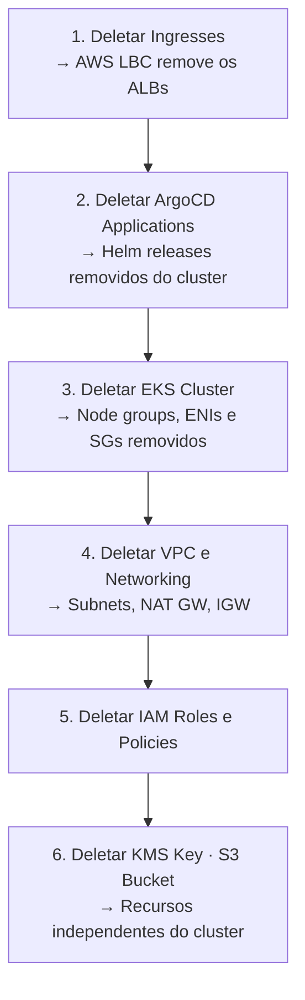

# 10. Destruição dos Recursos

Este guia remove todos os recursos AWS criados durante o laboratório, na ordem correta para evitar dependências bloqueadas.

!!! danger "Destruição irreversível"
    Os comandos abaixo **apagam permanentemente** todos os recursos provisionados. Execute apenas ao finalizar o laboratório. Não há rollback.

## Ordem de destruição

A ordem importa: recursos Kubernetes devem ser removidos antes do cluster para que os controllers (AWS LBC, EBS CSI) limpem os recursos AWS associados (ALBs, EBS volumes) antes de serem desligados.



---

## Passo 1 — Deletar Ingresses

Remova os Ingresses para que o AWS LBC apague os ALBs antes do cluster ser destruído.

```bash
kubectl delete ingress --all -n argocd
kubectl delete ingress --all -n vault
kubectl delete ingress --all -n harbor
```

Aguarde a remoção dos ALBs (~1 min):

```bash
aws elbv2 describe-load-balancers \
  --query 'LoadBalancers[?contains(LoadBalancerName, `k8s`)].LoadBalancerArn' \
  --output text
# Deve retornar vazio antes de prosseguir
```

---

## Passo 2 — Remover Applications do ArgoCD

Remover as Applications do ArgoCD dispara o pruning dos Helm releases:

```bash
kubectl delete application --all -n argocd
```

Aguarde os namespaces serem limpos:

```bash
kubectl get pods -A --field-selector=metadata.namespace!=kube-system,metadata.namespace!=argocd
# Deve retornar "No resources found"
```

---

## Passo 3 — Deletar o Cluster EKS

O `eksctl` remove o cluster, os node groups e os recursos de rede gerenciados pelo EKS (ENIs, Security Groups):

=== "Linux / macOS"

    ```bash
    eksctl delete cluster \
      --name $CLUSTER_NAME \
      --region $AWS_REGION \
      --wait
    ```

=== "Windows (PowerShell)"

    ```powershell
    eksctl delete cluster `
      --name $env:CLUSTER_NAME `
      --region $env:AWS_REGION `
      --wait
    ```

!!! note "Tempo estimado"
    A deleção do cluster leva ~10-15 minutos. O flag `--wait` bloqueia até a conclusão.

Verifique se o cluster foi removido:

```bash
aws eks list-clusters --query 'clusters' --output text
```

---

## Passo 4 — Deletar VPC e Networking

=== "Linux / macOS"

    ```bash
    # Deletar NAT Gateway (cobrado por hora)
    NAT_GW_ID=$(aws ec2 describe-nat-gateways \
      --filter "Name=vpc-id,Values=$VPC_ID" \
      --query 'NatGateways[?State==`available`].NatGatewayId' \
      --output text)

    aws ec2 delete-nat-gateway --nat-gateway-id $NAT_GW_ID

    # Aguardar deleção do NAT Gateway
    aws ec2 wait nat-gateway-deleted --nat-gateway-ids $NAT_GW_ID

    # Liberar Elastic IP associado ao NAT Gateway
    EIP_ALLOC=$(aws ec2 describe-addresses \
      --query 'Addresses[?Domain==`vpc`].AllocationId' \
      --output text)
    aws ec2 release-address --allocation-id $EIP_ALLOC

    # Deletar Internet Gateway
    IGW_ID=$(aws ec2 describe-internet-gateways \
      --filters "Name=attachment.vpc-id,Values=$VPC_ID" \
      --query 'InternetGateways[0].InternetGatewayId' --output text)
    aws ec2 detach-internet-gateway --internet-gateway-id $IGW_ID --vpc-id $VPC_ID
    aws ec2 delete-internet-gateway --internet-gateway-id $IGW_ID

    # Deletar subnets
    aws ec2 describe-subnets \
      --filters "Name=vpc-id,Values=$VPC_ID" \
      --query 'Subnets[].SubnetId' --output text | \
      tr '\t' '\n' | xargs -I{} aws ec2 delete-subnet --subnet-id {}

    # Deletar route tables (exceto a principal)
    aws ec2 describe-route-tables \
      --filters "Name=vpc-id,Values=$VPC_ID" \
      --query 'RouteTables[?Associations[0].Main!=`true`].RouteTableId' \
      --output text | tr '\t' '\n' | \
      xargs -I{} aws ec2 delete-route-table --route-table-id {}

    # Deletar VPC
    aws ec2 delete-vpc --vpc-id $VPC_ID
    ```

=== "Windows (PowerShell)"

    ```powershell
    # Deletar NAT Gateway
    $NAT_GW_ID = aws ec2 describe-nat-gateways `
      --filter "Name=vpc-id,Values=$VPC_ID" `
      --query 'NatGateways[?State==`available`].NatGatewayId' `
      --output text

    aws ec2 delete-nat-gateway --nat-gateway-id $NAT_GW_ID
    Start-Sleep -Seconds 60  # aguardar liberação

    # Liberar Elastic IP
    $EIP_ALLOC = aws ec2 describe-addresses `
      --query 'Addresses[?Domain==`vpc`].AllocationId' `
      --output text
    aws ec2 release-address --allocation-id $EIP_ALLOC

    # Deletar Internet Gateway
    $IGW_ID = aws ec2 describe-internet-gateways `
      --filters "Name=attachment.vpc-id,Values=$VPC_ID" `
      --query 'InternetGateways[0].InternetGatewayId' --output text
    aws ec2 detach-internet-gateway --internet-gateway-id $IGW_ID --vpc-id $VPC_ID
    aws ec2 delete-internet-gateway --internet-gateway-id $IGW_ID

    # Deletar subnets
    $SUBNETS = (aws ec2 describe-subnets `
      --filters "Name=vpc-id,Values=$VPC_ID" `
      --query 'Subnets[].SubnetId' --output json | ConvertFrom-Json)
    $SUBNETS | ForEach-Object { aws ec2 delete-subnet --subnet-id $_ }

    # Deletar route tables não-principais
    $RTS = (aws ec2 describe-route-tables `
      --filters "Name=vpc-id,Values=$VPC_ID" `
      --query 'RouteTables[?Associations[0].Main!=`true`].RouteTableId' `
      --output json | ConvertFrom-Json)
    $RTS | ForEach-Object { aws ec2 delete-route-table --route-table-id $_ }

    # Deletar VPC
    aws ec2 delete-vpc --vpc-id $VPC_ID
    ```

---

## Passo 5 — Deletar IAM Roles e Policies

=== "Linux / macOS"

    ```bash
    for ROLE in vault harbor aws-lbc ebs-csi; do
      ROLE_NAME="${CLUSTER_NAME}-${ROLE}"

      # Desanexar policies gerenciadas
      aws iam list-attached-role-policies --role-name $ROLE_NAME \
        --query 'AttachedPolicies[].PolicyArn' --output text | \
        tr '\t' '\n' | xargs -I{} aws iam detach-role-policy \
          --role-name $ROLE_NAME --policy-arn {}

      # Deletar role
      aws iam delete-role --role-name $ROLE_NAME
      echo "Role $ROLE_NAME deletada"
    done

    # Deletar policy do AWS LBC
    aws iam delete-policy \
      --policy-arn arn:aws:iam::${AWS_ACCOUNT_ID}:policy/AWSLoadBalancerControllerIAMPolicy
    ```

=== "Windows (PowerShell)"

    ```powershell
    foreach ($ROLE in @("vault", "harbor", "aws-lbc", "ebs-csi")) {
      $ROLE_NAME = "$env:CLUSTER_NAME-$ROLE"

      $POLICIES = (aws iam list-attached-role-policies --role-name $ROLE_NAME `
        --query 'AttachedPolicies[].PolicyArn' --output json | ConvertFrom-Json)
      $POLICIES | ForEach-Object {
        aws iam detach-role-policy --role-name $ROLE_NAME --policy-arn $_
      }

      aws iam delete-role --role-name $ROLE_NAME
      Write-Host "Role $ROLE_NAME deletada"
    }

    # Deletar policy do AWS LBC
    aws iam delete-policy `
      --policy-arn "arn:aws:iam::$env:AWS_ACCOUNT_ID:policy/AWSLoadBalancerControllerIAMPolicy"
    ```

---

## Passo 6 — Deletar KMS Key

As chaves KMS não são deletadas imediatamente — existe um período mínimo de espera de 7 dias (configurável até 30).

=== "Linux / macOS"

    ```bash
    aws kms schedule-key-deletion \
      --key-id $KMS_KEY_ARN \
      --pending-window-in-days 7
    ```

=== "Windows (PowerShell)"

    ```powershell
    aws kms schedule-key-deletion `
      --key-id $env:KMS_KEY_ARN `
      --pending-window-in-days 7
    ```

!!! info "Período de espera"
    A chave continua existindo por 7 dias e pode ser cancelada com `aws kms cancel-key-deletion`. Após o período, é deletada permanentemente.

---

## Passo 7 — Esvaziar e Deletar o Bucket S3

!!! danger "S3 é permanente"
    O bucket e todas as imagens do Harbor são apagados permanentemente. Não há recuperação.

=== "Linux / macOS"

    ```bash
    # Esvaziar o bucket (incluindo versões e delete markers)
    aws s3 rm s3://$HARBOR_S3_BUCKET --recursive

    # Deletar o bucket
    aws s3api delete-bucket --bucket $HARBOR_S3_BUCKET --region $AWS_REGION
    ```

=== "Windows (PowerShell)"

    ```powershell
    aws s3 rm "s3://$env:HARBOR_S3_BUCKET" --recursive
    aws s3api delete-bucket --bucket $env:HARBOR_S3_BUCKET --region $env:AWS_REGION
    ```

---

## Verificação Final

Confirme que não há recursos geradores de custo remanescentes:

```bash
# EKS
aws eks list-clusters --output text

# ALBs
aws elbv2 describe-load-balancers --query 'LoadBalancers[].LoadBalancerName' --output text

# NAT Gateways
aws ec2 describe-nat-gateways \
  --filter "Name=state,Values=available" \
  --query 'NatGateways[].NatGatewayId' --output text

# EBS Volumes órfãos
aws ec2 describe-volumes \
  --filters "Name=status,Values=available" \
  --query 'Volumes[].VolumeId' --output text

# Elastic IPs não associados
aws ec2 describe-addresses \
  --query 'Addresses[?AssociationId==null].AllocationId' --output text
```

Todos os comandos devem retornar vazio.

## Checklist

- [ ] Ingresses deletados (ALBs removidos pela AWS)
- [ ] Applications do ArgoCD deletadas
- [ ] Cluster EKS deletado com `eksctl delete cluster --wait`
- [ ] NAT Gateway deletado (principal custo por hora)
- [ ] Elastic IP liberado
- [ ] Internet Gateway deletado
- [ ] Subnets e Route Tables deletadas
- [ ] VPC deletada
- [ ] IAM Roles `vault`, `harbor`, `aws-lbc`, `ebs-csi` deletadas
- [ ] IAM Policy `AWSLoadBalancerControllerIAMPolicy` deletada
- [ ] KMS Key com deleção agendada (7 dias)
- [ ] Bucket S3 esvaziado e deletado
- [ ] Verificação final: sem recursos ativos gerando custo
