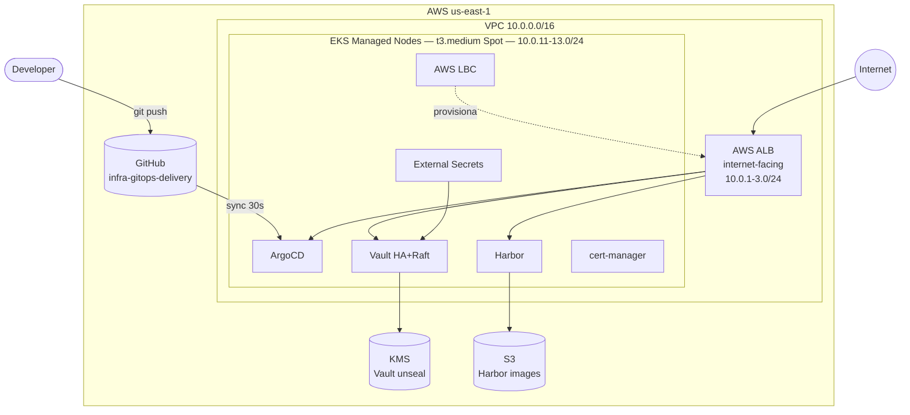
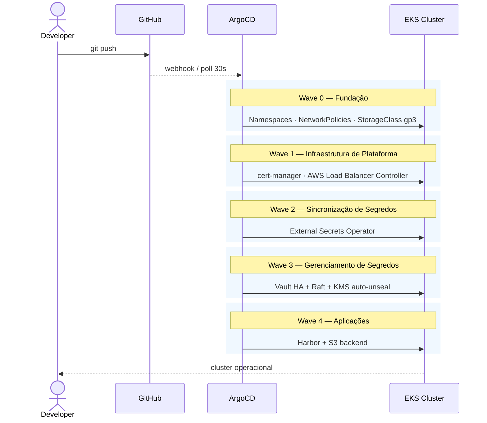

# EKS GitOps Blueprint

Bem-vindo ao guia de construção de um laboratório GitOps com padrões de produção usando AWS EKS, HashiCorp Vault, Harbor e ArgoCD.

## O que você vai construir

Ao final deste guia, você terá um cluster EKS totalmente operacional com:

- **ArgoCD** gerenciando todos os componentes do cluster de forma declarativa (App of Apps)
- **HashiCorp Vault** em modo HA com Raft e auto-unseal via KMS
- **External Secrets Operator** sincronizando segredos do Vault para o cluster
- **Harbor** como registry privado de imagens com backend S3
- **AWS Load Balancer Controller** provisionando ALBs automaticamente
- **cert-manager** emitindo certificados Let's Encrypt automaticamente

## Arquitetura

## Decisões Arquiteturais

| Componente | Escolha | Motivo |
|---|---|---|
| EKS Nodes | t3.medium Spot, 3 AZs | Custo mínimo com HA |
| IAM Auth | EKS Pod Identity | Padrão atual AWS |
| Network Policy | VPC CNI nativo | Sem CNI adicional |
| Vault Deploy | HA + Raft integrado | Sem dependência externa |
| Vault Unseal | AWS KMS | Obrigatório com Spot |
| Secrets | External Secrets Operator | Desacoplado e auditável |
| Ingress | AWS LBC + ALB | Nativo AWS |
| TLS | cert-manager + Let's Encrypt | Gratuito e automático |
| Harbor Storage | S3 | Persistência independente |
| GitOps Pattern | ArgoCD App of Apps | Escalável |

## Fluxo GitOps

Nenhum `kubectl apply` manual em produção. Todo estado é declarado em Git e sincronizado em ordem determinística pelas sync waves do ArgoCD.

## Repositórios

| Repositório | Visibilidade | Finalidade |
|---|---|---|
| `eks-gitops-blueprint` | Público | Este guia |
| `infra-gitops-delivery-blueprint` | Público | Manifestos com placeholders (fork) |
| `infra-gitops-delivery` | Privado | Manifestos reais do cluster |

## Etapas do Guia

1. [Pré-requisitos](01-prerequisites.md) — ferramentas, permissões e configuração inicial
2. [VPC e Networking](02-vpc-networking.md) — rede isolada com subnets públicas e privadas
3. [Cluster EKS](03-eks-cluster.md) — EKS com Managed Node Groups e Spot
4. [ArgoCD](04-argocd.md) — instalação e padrão App of Apps
5. [HashiCorp Vault](05-vault.md) — HA + Raft + auto-unseal KMS
6. [Harbor Registry](06-harbor.md) — registry privado com backend S3
7. [External Secrets Operator](07-external-secrets.md) — integração Vault → Kubernetes Secrets
8. [cert-manager](08-cert-manager.md) — TLS automático com Let's Encrypt
9. [AWS Load Balancer Controller](09-aws-load-balancer.md) — ALB nativo no EKS

## Custo Estimado

Para um laboratório com 3 nodes t3.medium Spot em us-east-1:

| Recurso | Custo estimado |
|---|---|
| EKS Control Plane | $0.10/hora (~$2,40/dia) |
| 3x t3.medium Spot | ~$0.007/hora cada (~$0.50/dia) |
| NAT Gateway | ~$0.045/hora (~$1,08/dia) |
| ALB | ~$0.008/hora (~$0.20/dia) |
| S3 (Harbor) | Frações por GB armazenado |
| KMS (Vault) | ~$1/mês por chave |
| **Total estimado** | **~$4-5/dia** |

!!! warning "Destrua os recursos ao finalizar"
    Todos os recursos AWS devem ser destruídos ao fim do laboratório para evitar cobranças desnecessárias. O último capítulo deste guia documenta os passos de limpeza.
